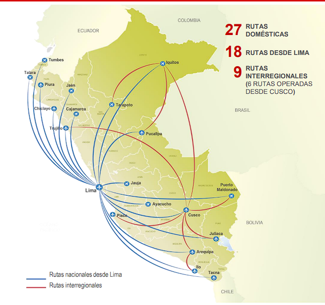
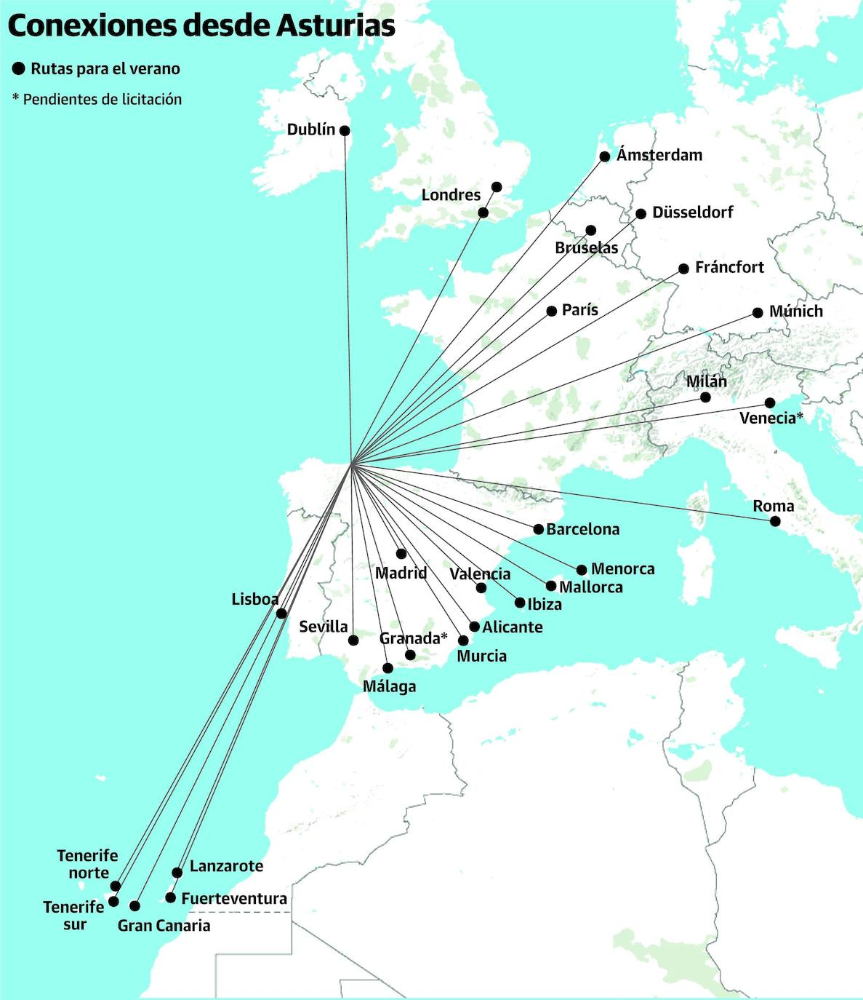
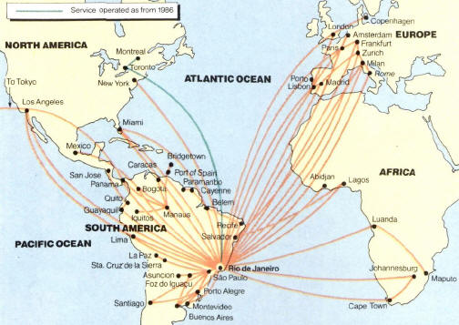

# Estructuras de Datos
## Tarea sobre Grafos
--------
>## Integrantes
>- Fernandez Villarreal , Jorge
>- Bustamante Cruzado , Raul
>- Miranda Quispe , Bruno
------

El presente trabajo consiste en implementar una estructura de datos de tipo grafo y los diferentes algoritmos de búsqueda. Como caso aplicativo, debe implementarse un JSON file parser que permita construir el grafo a partir de un dataset en formato JSON.

La estructura del grafo debe soportar los métodos y algoritmos descritos a continuacion:


## Graph(Grafo)

El archivo "graph.h" implementa la clase Graph, que representa un grafo simple. Un grafo consta de vértices y aristas, donde los vértices representan entidades y las aristas representan las relaciones entre ellos. Esta implementación utiliza una estructura de datos de mapa no ordenado (unordered_map) para almacenar los vértices del grafo.

### Graph data structure

* El grafo debe ser dinámico (inserciones. eliminaciones, búsquedas, ...)
* Para nuestro caso se esta dando soporte para un grafo no dirigido.
* Se estan considerando  solo grafos simples: sin loops ni multi-aristas.

### Estructuras de datos Edge y Vertex

El archivo define las estructuras de datos Edge y Vertex. La estructura Edge representa una arista, que contiene dos punteros a los vértices que conecta y un peso asociado a la arista. La estructura Vertex representa un vértice, que contiene los datos del vértice y una lista de aristas que lo conectan con otros vértices.

### Métodos de la clase Graph
```cpp 
insertVertex(string id, TV vertex): // Inserta un nuevo vértice en el grafo con un ID y datos asociados.
getVertices() const: // Devuelve un mapa no ordenado que contiene todos los vértices del grafo.
getVertex(const string& id): // Devuelve un puntero al vértice con el ID especificado.
createEdge(string id1, string id2, TE w): // Crea una nueva arista entre dos vértices existentes con un peso asociado.
deleteVertex(string id): // Elimina un vértice del grafo.
deleteEdge(string id1, string id2): // Elimina una arista entre dos vértices existentes.
isConnected(): // Verifica si el grafo está conectado, es decir, si hay un camino entre cada par de vértices.
empty(): // Verifica si el grafo está vacío.
clear(): // Limpia el grafo, eliminando todos los vértices y aristas.
display(): // Muestra por consola los vértices y aristas del grafo.
displayVertex(string id): // Muestra por consola la información de un vértice específico.
findById(string id): // Devuelve los datos asociados a un vértice específico mediante su ID.
```

### Función isConnected()
```c++
bool isConnected() {
  if (vertexes.empty()) {
    return false;
  }

  string startVertex = vertexes.begin()->first;

  std::unordered_map<string, bool> visited;
  DFS(startVertex, visited);

  for (const auto& vertex : vertexes) {
    if (!visited[vertex.first]) {
      return false;
    }
  }

  return true;
}
```

La función `isConnected()` verifica la conectividad de todos los vértices de un grafo. Primero, comprueba si la lista de vértices está vacía; si es así, devuelve `false`. Si hay vértices, selecciona uno de ellos como punto de partida y realiza un recorrido del grafo utilizando una búsqueda en profundidad (DFS). Durante el recorrido, se marca cada vértice visitado en un diccionario llamado `visited`. Después del recorrido, se verifica si todos los vértices están marcados como visitados en el diccionario. Si hay algún vértice no visitado, se devuelve `false`; de lo contrario, se devuelve `true`, lo que indica que todos los vértices están conectados entre sí.

### Algoritmos:

#### A* (A-Star)
El algoritmo A* es un algoritmo de búsqueda informada que encuentra el camino más corto desde un vértice de origen hasta un vértice de destino en un grafo ponderado. Combina el uso de heurísticas con la búsqueda en anchura, lo que le permite ser más eficiente al explorar las posibles rutas.

El archivo "astar.h" implementa la clase AStar que utiliza el algoritmo A* para realizar búsquedas en un grafo. A continuación, se describen las principales funcionalidades de esta implementación:

```cpp
setGraph(const Graph<TV, TE>& g): // Establece el grafo en el que se realizará la búsqueda.
setHeuristic(const unordered_map<string, TE>& heuristic_map): // Establece las heurísticas (valores estimados) para cada vértice del grafo.
clear(): // Limpia las puntuaciones y los registros internos del algoritmo.
getPath(const string& end_vertex): // Obtiene el camino más corto desde el vértice de inicio hasta el vértice de destino especificado como argumento.
displayPath(const vector<string>& path, unordered_map<string, City*> ciudadHashtable): // Muestra por consola el camino obtenido en formato legible para el usuario, utilizando un diccionario de vértices para obtener información adicional sobre cada vértice.
aStarSearch(const string& start_vertex, const string& end_vertex): // Realiza la búsqueda A* desde el vértice de inicio hasta el vértice de destino especificados como argumentos.
```


#### BFS (Búsqueda en Anchura)
El archivo "bfs.h" implementa la clase BFS, que utiliza el algoritmo de Búsqueda en Anchura (BFS) para realizar búsquedas en un grafo. A continuación, se describen las principales funcionalidades de esta implementación:

```cpp
BFS(Graph<TV, TE>& g): //Constructor de la clase BFS. Recibe como argumento el grafo en el que se realizará la búsqueda.
breadthFirstSearch(const string& startVertex, const string& endVertex): //Realiza la búsqueda en anchura desde el vértice de inicio hasta el vértice de destino especificados como argumentos. Utiliza una cola y un conjunto de vértices visitados para explorar los vértices adyacentes en orden de cercanía.
getPath(const string& startVertex, const string& endVertex): //Obtiene el camino más corto desde el vértice de inicio hasta el vértice de destino especificados como argumentos. Reconstruye el camino siguiendo los punteros previos almacenados durante la búsqueda en anchura.
displayPath(const vector<string>& path, unordered_map<string, City*> ciudadHashtable): //Muestra por consola el camino obtenido en formato legible para el usuario, utilizando un diccionario de vértices para obtener información adicional sobre cada vértice.
```

El algoritmo de BFS se basa en recorrer el grafo en niveles, explorando primero los vértices adyacentes al vértice de inicio, luego los vértices adyacentes a esos vértices y así sucesivamente. Utiliza una cola para mantener un seguimiento de los vértices que se deben visitar y un conjunto para marcar los vértices ya visitado.


#### DFS (Búsqueda en Profundidad)
El archivo "dfs.h" implementa la clase DFS, que utiliza el algoritmo de Búsqueda en Profundidad (DFS) para realizar búsquedas en un grafo. A continuación, se describen las principales funcionalidades de esta implementación:

```cpp
DFS(Graph<TV, TE>& g): //Constructor de la clase DFS. Recibe como argumento el grafo en el que se realizará la búsqueda.
depthFirstSearch(const string& startVertex): //Realiza la búsqueda en profundidad desde el vértice de inicio especificado como argumento. Utiliza un mapa para almacenar los vértices visitados y un mapa de punteros previos para rastrear el camino recorrido.
getPath(const string& endVertex): //Obtiene el camino desde el vértice de inicio hasta el vértice de destino especificado como argumento. Reconstruye el camino siguiendo los punteros previos almacenados durante la búsqueda en profundidad.
displayPath(const vector<string>& path, unordered_map<string, City*>& ciudadHashtable): //Muestra por consola el camino obtenido en formato legible para el usuario, utilizando un diccionario de vértices para obtener información adicional sobre cada vértice.
```

El algoritmo de DFS se basa en explorar el grafo de forma recursiva, siguiendo un camino hasta llegar a un vértice sin visitar, y luego retrocediendo para explorar otros caminos. Utiliza una pila de llamadas recursivas para realizar el seguimiento de los vértices visitados.

#### Dijkstra

El archivo "dijkstra.h" implementa la clase Dijkstra, que utiliza el algoritmo de Dijkstra para encontrar el camino más corto en un grafo ponderado. A continuación, se describen las principales funcionalidades de esta implementación:


```cpp
Dijkstra(Graph<TV, TE>& g): //constructor que recibe un objeto Graph y lo utiliza para inicializar el grafo en el que se realizarán los cálculos del camino más corto.
void shortestPath(const string& startVertex): //encuentra el camino más corto desde un vértice de inicio dado utilizando el algoritmo de Dijkstra. Calcula las distancias mínimas y los nodos previos para cada vértice en el grafo.
vector<string> getPath(const string& endVertex): //devuelve el camino más corto desde el vértice de inicio hasta un vértice de destino dado. Reconstruye el camino utilizando los nodos previos calculados durante la ejecución del algoritmo de Dijkstra.
void displayPath(const vector<string> path, unordered_map<string, City*> ciudadHashtable):// muestra en la salida estándar el camino más corto encontrado. Recibe como parámetro el camino calculado y un mapa hash que asocia los identificadores de los vértices con objetos de tipo City.
```
#### Kruskal
El archivo "kruskal.h" implementa la clase Kruskal, que utiliza el algoritmo de Kruskal para encontrar el árbol de expansión mínima en un grafo ponderado. A continuación, se describen las principales funcionalidades de esta implementación:


```cpp
Kruskal(Graph<TV, TE>& g): //Constructor de la clase Kruskal. Recibe como argumento el grafo en el que se realizará la búsqueda.
minimumSpanningTree(): //Encuentra el árbol de expansión mínima utilizando el algoritmo de Kruskal. Ordena las aristas del grafo por peso y va seleccionando las aristas de menor peso que no formen un ciclo hasta completar el árbol de expansión mínima.
getPath(const string& startVertex, const string& endVertex):// Obtiene el camino desde el vértice de inicio hasta el vértice de destino especificados como argumentos. Utiliza el árbol de expansión mínima obtenido por el algoritmo de Kruskal y realiza una búsqueda en profundidad (DFS) en el grafo auxiliar formado por las aristas del árbol.
displayPath(const vector<string>& path, unordered_map<string, City*>& ciudadHashtable): //Muestra por consola el camino obtenido en formato legible para el usuario, utilizando un diccionario de vértices para obtener información adicional sobre cada vértice.
```

### Estructura Ciudad


```cpp
name: //Nombre de la ciudad.
city: //Nombre de la ciudad (puede ser igual al campo name o ser un nombre alternativo).
country: //Nombre del país en el que se encuentra la ciudad.
airport_id: //Identificador del aeropuerto de la ciudad.
destinations: //Vector de cadenas que representa los destinos disponibles desde la ciudad. Cada cadena es un identificador de ciudad o aeropuerto de destino.
longitude: //Longitud geográfica de la ciudad.
latitude: //Latitud geográfica de la ciudad.
```
Estos campos almacenan la información relevante de cada aeropuerto que se lee del archivo JSON y se utiliza en el programa para construir el grafo y realizar los cálculos de rutas y distancias. Un ejemplo aplicativo son las rutas nacionales e internacionales que podemos ver en el siguiente grafico.


Otro ejemplo a utilizar es efectivamente todas las conexiones internacionales que existen.

Ejemplo de vuelos en Europa en una sola region.

Ejemplo de conexiones de vuelos en varios continentes.



## Explicacion del main.cpp

* El programa muestra un menú y permite al usuario seleccionar un archivo JSON que contiene datos de aeropuertos.
* El programa lee el archivo JSON y crea vértices en el grafo para cada aeropuerto.
* El programa crea aristas en el grafo para representar las conexiones entre aeropuertos, utilizando la distancia euclidiana entre las coordenadas geográficas de los aeropuertos.
* El programa ofrece varias opciones en el menú para realizar operaciones en el grafo:
  * Insertar un vértice: Permite al usuario agregar un nuevo vértice (aeropuerto) al grafo.
  * Eliminar un vértice: Permite al usuario eliminar un vértice (aeropuerto) del grafo
  * Eliminar una arista: Permite al usuario eliminar una arista (conexión) entre dos aeropuertos en el grafo.
  * Insertar una arista: Permite al usuario agregar una nueva arista (conexión) entre dos aeropuertos en el grafo.
  * Seleccionar la distancia más corta por Dijkstra: Calcula y muestra la ruta más corta entre dos aeropuertos utilizando el algoritmo de Dijkstra
  * Seleccionar la distancia más corta por A*: Calcula y muestra la ruta más corta entre dos aeropuertos utilizando el algoritmo de A*.
  * Seleccionar la distancia más corta por BFS: Calcula y muestra la ruta más corta entre dos aeropuertos utilizando el algoritmo de BFS (Búsqueda en Anchura).
  * Seleccionar la distancia más corta por DFS: Calcula y muestra la ruta más corta entre dos aeropuertos utilizando el algoritmo de DFS (Búsqueda en Profundidad).
  * Seleccionar la distancia más corta por Kruskal: Calcula y muestra la ruta más corta entre dos aeropuertos utilizando el algoritmo de Kruskal para el árbol de expansión mínima
  * Resumen de las 5 distancias con tiempos de ejecución: Muestra un resumen de las cinco distancias anteriores, junto con los tiempos de ejecución de cada algoritmo.
  * Mostrar el grafo actualizado: Muestra el grafo actualizado con sus vértices y aristas.

El programa utiliza las clases y algoritmos definidos en los archivos graph.h, dijkstra.h, astar.h, bfs.h, dfs.h y kruskal.h para realizar las operaciones en el grafo.

## JSON file parser
El programa utiliza la biblioteca "json.hpp" para realizar el parseo del JSON. Esta biblioteca proporciona funciones para convertir objetos JSON en tipos de datos C++ y viceversa.

A continuación, se definen tres funciones principales relacionadas con el parseo del JSON:
```cpp
leerArchivoJSON(const string& filename): //Esta función recibe el nombre de un archivo JSON como entrada y devuelve un objeto json que contiene los datos del archivo. Utiliza la biblioteca de flujo de archivos ifstream para abrir y leer el archivo JSON. Luego, utiliza el operador >> para cargar los datos en un objeto json y finalmente cierra el archivo. Si ocurre algún error al abrir o leer el archivo, se muestra un mensaje de error.

getCityFromJSON(const json& data): //Esta función recibe un objeto json que representa los datos de un aeropuerto y devuelve un puntero a un objeto City que contiene los datos del aeropuerto. Utiliza las funciones data["NombreDePropiedad"] para obtener los valores de las propiedades del objeto JSON y los asigna a los campos correspondientes de un nuevolo  objeto City.

getCityString(const json& data): //Esta función recibe un objeto json que representa los datos de un aeropuerto y devuelve una cadena de caracteres que representa el objeto JSON. Utiliza la función data.dump() para convertir el objeto json en una cadena de caracteres.
```

Estas funciones son utilizadas en el programa principal en los siguientes puntos:

* Después de leer el archivo JSON en la variable data, se llama a la función getCityFromJSON para cada objeto json dentro de data y se crea un objeto City correspondiente para cada aeropuerto. Estos objetos City se almacenan en un unordered_map llamado ciudadHashtable, donde la clave es el ID del aeropuerto y el valor es el objeto City.

* Cuando se inserta un vértice en el grafo, se llama a la función getCityFromJSON para crear un nuevo objeto City y se agrega a ciudadHashtable utilizando el ID del aeropuerto como clave.

* Al crear aristas en el grafo, se calcula la distancia euclidiana entre las coordenadas de los aeropuertos utilizando la función calcularDistanciaEuclidiana, que se basa en las coordenadas almacenadas en los objetos City en ciudadHashtable.


## Plan de Actividades

A continuación se muestra el plan de actividades para el desarrollo del programa:

| Actividad                                             | Descripción                                                                                                                                                                                             | Responsable         |
|-------------------------------------------------------|---------------------------------------------------------------------------------------------------------------------------------------------------------------------------------------------------------|---------------------|
| Leer archivo JSON                                     | Leer y cargar los datos de un archivo JSON que contiene información sobre los aeropuertos.                                                                                                             | Raul Bustamante |
| Crear grafo                                           | Utilizar los datos cargados del archivo JSON para crear un grafo, donde los vértices representan los aeropuertos y las aristas representan las conexiones entre los aeropuertos con sus distancias. | Raul Bustamante |
| Insertar vértice                                      | Permitir al usuario insertar un nuevo aeropuerto como vértice en el grafo.                                                                                                                               | Equipo             |
| Eliminar vértice                                      | Permitir al usuario eliminar un aeropuerto existente del grafo.                                                                                                                                         |  Equipo            |
| Insertar arista                                       | Permitir al usuario crear una conexión (arista) entre dos aeropuertos existentes en el grafo, especificando la distancia entre ellos.                                                                  | Equipo             |
| Eliminar arista                                       | Permitir al usuario eliminar una conexión (arista) entre dos aeropuertos existentes en el grafo.                                                                                                       |   Equipo           |
| Desarrollar algoritmo de Dijkstra                     | Implementar el algoritmo de Dijkstra para calcular la distancia más corta entre dos aeropuertos en el grafo.                                                                                             | Bruno Miranda |
| Desarrollar algoritmo A*                              | Implementar el algoritmo A* para calcular la distancia más corta entre dos aeropuertos en el grafo, teniendo en cuenta una heurística estimada.                                                        | Bruno Miranda |
| Desarrollar algoritmo BFS                             | Implementar el algoritmo de búsqueda en anchura (BFS) para calcular la distancia más corta entre dos aeropuertos en el grafo.                                                                          | Jorge Fernandez |
| Desarrollar algoritmo DFS                             | Implementar el algoritmo de búsqueda en profundidad (DFS) para calcular la distancia más corta entre dos aeropuertos en el grafo.                                                                      | Jorge Fernandez |
| Desarrollar algoritmo de Kruskal                      | Implementar el algoritmo de Kruskal para calcular el árbol de expansión mínima del grafo, que representa las conexiones más económicas entre todos los aeropuertos.                                      | Jorge Fernandez |
| Calcular distancia más corta usando algoritmo Dijkstra | Utilizar el algoritmo de Dijkstra desarrollado para calcular la distancia más corta entre dos aeropuertos en el grafo.                                                                                | Equipo |
| Calcular distancia más corta usando algoritmo A*       | Utilizar el algoritmo A* desarrollado para calcular la distancia más corta entre dos aeropuertos en el grafo, teniendo en cuenta una heurística estimada.                                              | Equipo |
| Calcular distancia más corta usando algoritmo BFS      | Utilizar el algoritmo de BFS desarrollado para calcular la distancia más corta entre dos aeropuertos en el grafo.                                                                                     | Equipo |
| Calcular distancia más corta usando algoritmo DFS      | Utilizar el algoritmo de DFS desarrollado para calcular la distancia más corta entre dos aeropuertos en el grafo.                                                                                     | Equipo |
| Calcular árbol de expansión mínima usando Kruskal     | Utilizar el algoritmo de Kruskal desarrollado para calcular el árbol de expansión mínima del grafo, que representa las conexiones más económicas entre todos los aeropuertos.                          | Equipo |
| Mostrar resumen de distancias                          | Mostrar un resumen de las cinco distancias más cortas (calculadas con diferentes algoritmos) entre dos aeropuertos, junto con los tiempos de ejecución de cada algoritmo.                              | Equipo |
| Mostrar grafo actualizado                             | Mostrar el grafo actualizado con los aeropuertos y conexiones después de realizar las operaciones de inserción o eliminación.                                                                           | Equipo |

## Código en Replit

URL: https://replit.com/@EDUTEC2023-2/Grafos

## Nota

La información proporcionada en formato JSON estaba corrupta y requirió que asignáramos las coordenadas de longitud y latitud correctas, además de eliminar manualmente los identificadores de los aeropuertos que ya no están en funcionamiento.


Responsables: Raul Bustamante, Bruno Miranda, Jorge Fernandez
